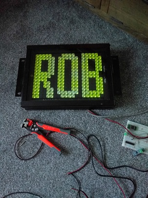

# Bright-Tech Flip Dot

Reverse engineer of old Bright-Tech flip dot display protocol

purchased a pair of these off ebay and have been working out the RS485 protocol by trial and error
here you can see some of the success so far 'cracking the code' 

will document this on a wiki here on github https://github.com/robjen/Bright-Tech-Flip-Dot/wiki

I will go on to write a simple driver for Arduino use

big starting point to decoding was:
https://mattscode.com/category/flip-dot/

see first couple of pages where Matt is looking at the messages sent, after that he builds his own controller electronics, I'm looking to avoid doing that

I've gone further working out more of the message format

I have also won a controller on ebay so with a bit of luck that will give me more original messages and help me decode it further

watch this space ...
